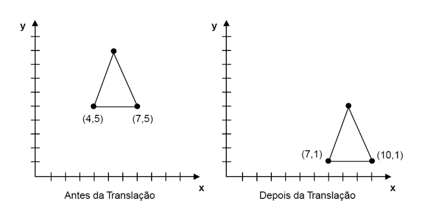
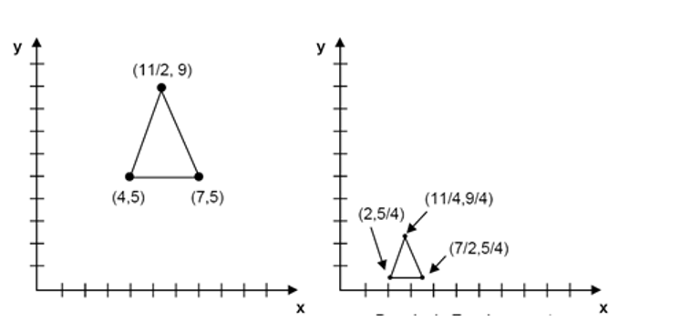
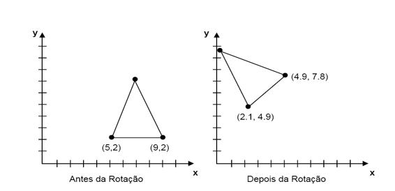

# Computação Gráfica

* Segundo a ISO (International Organization of Standardization), computação gráfica é um conjunto de ferramentas e técnicas para converter dados para ou de um dispositivo gráfico através do computador.

## Conceitos básicos:

   * ***Pixel***: O arranjo de linhas e colunas forma a matriz da imagem digital. Quanto maior a quantidade de linhas e colunas menor será o pixel e consequentemente a imagem final apresentará melhor resolução.
      * *O **Pixel** é a menor unidade de medida de uma imagem digital.
      * *A imagem tem um tamanho fixo, mas a quantidade de linhas e colunas pode variar. Quanto mais linhas e colunas mais pixels terão e menores eles ficarão, mas em compensação a imagem ter uma melhor resolução

   * ***Resolução espacial***: A resolução espacial é a capacidade de se distinguir detalhes em uma imagem digital. Quanto maior for a resolução, melhor será o nível de detalhes que poderá ser visualizado. A resolução espacial pode ser representada de várias formas, as mais comuns são pares de linhas por unidade de medida ou pontos (pixels) por unidade de medida. 
      * *A resolução de uma imagem, quanto mais linhas e colunas maior a qualidade.

---

### Em uma imagem, usamos o sistema de coordenadas:
   
   * O sistema de coordenadas serve para nos dar uma referência em termos de medidas do tamanho e posição dos objetos dentro de nossa área de trabalho.
   * Podemos utilizar diferentes sistemas de coordenadas para descrever os objetos modelados em um sistema 2D.
   * Um determinado sistema de coordenadas é denominado de *Sistema de Referência* se for um sistema de coordenadas cartesianas para alguma finalidade específica.
   * Ao definirmos um sistema de coordenadas de referência, devemos especificar dois aspectos principais: a unidade de referência básica e os limites extremos dos valores aceitos para descrever os objetos.
   * Devemos informar a unidade básica e os limites dos valores aceitos.
   
---

### Utilizando as coordenadas:
   
   * *Para mexermos com as coordenadas, precisamos entender alguns fundamentos:*
      
      * ***Translação*** é movimentar o objeto, movendo todos os seus pontos (x,y). Para ficar mais fácil podemos dar valores aos pontos, exemplo:
         * 

      * ***Transformação de Escala*** ou escalonar, é significa mudar as dimensões de escala. Para fazer com que uma imagem definida por um conjunto de pontos mude de tamanho, teremos de multiplicar os valores de suas coordenadas por um fator de escala.
         * 
   
      * ***Transformação de rotação*** é usada para girar objetos. Para isso utilizamos a fórmula:    
         * x’ = x cos () – y sen () **//// & ////** y’ = y cos () + x sen ()           
            * (Sendo  = teta)
         * 
      

* Bibliografia

   * AZEVEDO, E. CONCI, A. Computação Gráfica: Teoria e Prática. - Ed. Campus, 2003.
   * AZEVEDO, E. CONCI, A. Computação Gráfica - Vol. 2, Ed. Campus, 2007
   * JUNIOR, Annibal Hetem. Computação Gráfica: Série Fundamentos de Informática - Ed. LTC, 2006.

   Jonathan.rogeri@docente.unip.br

